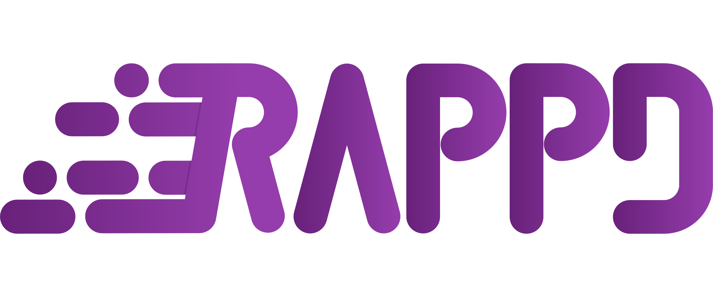

<p align="center">
   
</p>

<h1 align="center">Rapid Application Development Framework</h1>
<p align="center">
   <a href="https://dev.azure.com/Stecx/Rappd/_build/latest?definitionId=18&branchName=master"></a>
   <a href="https://app.codacy.com/gh/StecxDE/Rappd/dashboard?utm_source=gh&utm_medium=referral&utm_content=&utm_campaign=Badge_grade"></a>
</P>
<p align="center">Speed up your C# software development.</p>

## Features

-   [CQRS](#cqrs---command-and-query-responsibility-segregation)

## CQRS - Command and Query Responsibility Segregation

The CQRS part of the Rappd Framework is a fast and simple feature used to implement Commands and Queries in your application.

### Installation

Add the respective package to your project:

AspNet (DI support)
```bash
PM> Install-Package Rappd.CQRS.AspNet
```

Direct
```bash
PM> Install-Package Rappd.CQRS
```

### Usage

1.  Define a Query/Command

```csharp
public record TestQuery : Query<TestQuery, int>;
```

2.  Define a Handler for your Query/Command

```csharp
public record TestQueryHandler : TestQuery.Handler
{
    public override Task<Result<int>> HandleAsync(CancellationToken cancellationToken)
        => Task.FromResult(1);
}
```

3.  Send your Query/Command and get your response

```csharp
var response = await TestQuery.SendAsync();
```

#### For the full documentation of this feature look at the docs: [Docs: CQRS](/docs/CQRS.md)
