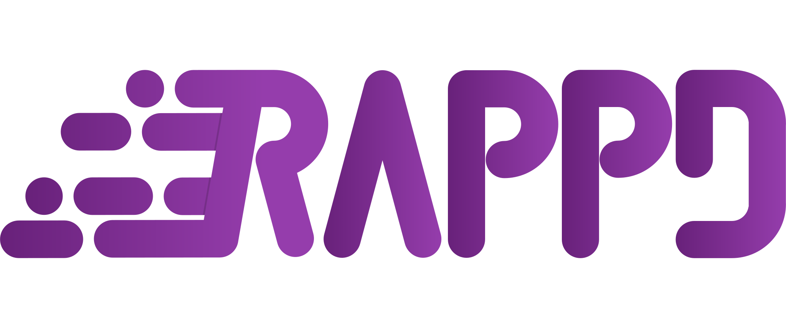

<p align="center">
   
</p>
<h1 align="center">Rapid Application Development Framework</h1>
<p align="center">Speed up your C# software development.</p>

## Features

-   [CQRS](#cqrs---command-and-query-responsibility-segregation)

## CQRS - Command and Query Responsibility Segregation

The CQRS part of the Rappd Framework is a fast and simple feature used to implement Commands and Queries in your application.

### Templates

Query
```csharp
public record TestQuery : Query<TestQuery, int>;
public record TestQueryHandler : TestQuery.Handler
{
    public override Task<Result<int>> HandleAsync(CancellationToken cancellationToken)
        => Task.FromResult(1);
}
```

QueryWithParameter
```csharp
public record TestQuery : Query<TestQuery, int, int>;
public record TestQueryHandler : TestQuery.Handler
{
    public override Task<Result<int>> HandleAsync(CancellationToken cancellationToken)
        => Task.FromResult(1);
}
```

Command
```csharp
public record TestCommand : Command<TestCommand>;
public record TestCommandHandler : TestCommand.Handler
{
    public override Task<Result> HandleAsync(CancellationToken cancellationToken)
        => Task.FromResult(Results.Ok);
}
```

CommandWithParameter
```csharp
public record TestCommand : Command<TestCommand, int>;
public record TestCommandHandler : TestCommand.Handler
{
    public override Task<Result> HandleAsync(CancellationToken cancellationToken)
        => Task.FromResult(Results.Ok);
}
```